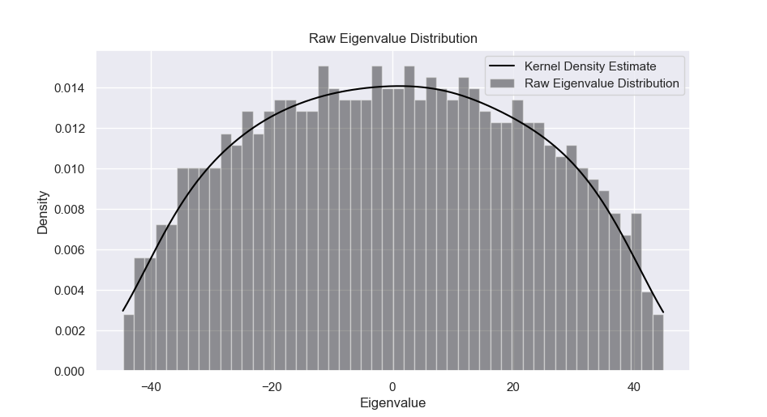

# Introduction

A python library for investigating some of the basic / classical elements of
Random Matrix Theory, including eigenvalue generation, trimming, unfolding and
computation and plotting of some popular spectral observables.

# Table of Contents
- [Introduction](#introduction)
- [Table of Contents](#table-of-contents)
  - [Notes on Development](#notes-on-development)
- [Installation](#installation)
  - [Local Installation Using `venv` (recommended)](#local-installation-using-venv-recommended)
  - [Global Installation](#global-installation)
  - [Windows](#windows)
- [A Brief Tour](#a-brief-tour)
- [Documentation](#documentation)
  - [API Overview](#api-overview)
    - [Main Classes and Methods](#main-classes-and-methods)
- [Development](#development)
  - [Installation](#installation-1)
  - [Testing](#testing)
- [Limitations](#limitations)


## Notes on Development

This libary is still undergoing significant development. The overall API (e.g.
basic classes, properties, and methods) will likely remain stable from this
point, but function and method arguments are still quite likely to change. I
can't provide any guarantees at this point that numerical results will be stable
from version to version.

In the meantime, please feel free to post issues or ask *any* questions relating
to the library on [Github](https://github.com/stfxecutables/empyricalRMT/issues).

# Installation

As always, using a virtual environment is recommended to minimize the chance of
conflicts. However, you _should_ be okay doing a global `pip install empyricalRMT`
to try out the library.


## Local Installation Using `venv` (recommended)

Navigate to the project that you wish to use empyricalRMT in.

```bash
cd MyProject
```

Create and active the virtual environment. Replace "env" with whatever name
you prefer.

```bash
python -m venv env && source env/bin/activate
```

Now install locally either from pip:

```bash
pip install --upgrade empyricalRMT
```

or from source:

```bash
git clone https://github.com/stfxecutables/empyricalRMT /path/to/your/favourite/location/empyricalRMT
cd MyProject  #
pip install -e /path/to/your/favourite/location/empyricalRMT
```

If using Windows (which I haven't tested this library on), you *should* be able to
install this in whatever manner you usually install libraries from source or pip.


## Global Installation

Via pip:

```bash
pip install empyricalRMT
```

From source:

```bash
git clone https://github.com/stfxecutables/empyricalRMT
cd empyricalRMT
pip install -e .
```

Note that this will install the library "globally" if you haven't activated
a virtual environment of some kind.


## Windows

The above *should* still all work on Windows, although you may have to follow
[modified instructions for setting up the *venv*](https://docs.python.org/3/library/venv.html).

If you run into issues specific to this library that you think might be
Windows-related, please do report them, but keep in mind I currently can only
test on Windows via virtual machine :(

# A Brief Tour

Numerically investigate the extent to which a GOE matrix agrees with theory:

```python
import empyricalRMT as rmt

from empyricalRMT.construct import generate_eigs
from empyricalRMT.eigenvalues import Eigenvalues

# generate eigenvalues from a 1000x1000 matrix from the Gaussian Orthogonal Ensemble
vals = generate_eigs(matsize=1000, kind="goe")
eigs = Eigenvalues(eigs)

# verify Wigner's semicircle law:
eigs.plot_distribution()
```


```python
# unfold the eigenvalues via Wigner's semi-circle law:
unfolded = eigs.unfold(smoother="goe")
# or unfold via polynomial:
unfolded = eigs.unfold(smoother="poly", degree=7)
# optionally detrend unfolded vals via Empirical Mode Decomposition:
unfolded = eigs.unfold(smoother="poly", degree=7, detrend=True)

# plot some classic observables and compare to theory
ensembles = ["poisson", "goe"]  # theoretically expected curves to plot
unfolded.plot_nnsd(ensembles=ensembles)  # nearest neighbours spacings
unfolded.plot_nnnsd(ensembles=["goe"])  # next-nearest neighbours spacings
unfolded.plot_spectral_rigidity(ensembles=ensembles)
unfolded.plot_level_variance(ensembles=ensembles)
```


Visually inspect / detect a bad unfolding fit:

```python
from empyricalRMT.eigenvalues import Eigenvalues

# generate time series data
T = np.random.standard_normal([1000, 250])
eigs = Eigenvalues.from_time_series(T, trim_zeros=False)
unfolded = eigs.unfold(degree=5)
unfolded.plot_fit()
```


Sample eigenvalues from *large* GOE matrices (provided they can fit in memory) ***fast*** via
[equivalently distributed tridiagonal matrices](https://dspace.mit.edu/handle/1721.1/115982):

```python
from empyricalRMT.construct import generate_eigs

eigs = generate_eigs(matsize=30000, kind="goe", log=True)

""" Output:
>>> 15:40:39 (Mar10) -- computing eigenvalues...
>>> 15:41:05 (Mar10) -- computed eigenvalues.
"""
```
E.g. under 30 seconds (Processor: 4-core / 8-threads, Intel(R)
Xeon(R) CPU E3-1575M v5 @ 3.00GHz).


# Documentation

The [source code](https://github.com/stfxecutables/empyricalRMT/tree/master/empyricalRMT)
is well documented, so be sure to read the documentation comments. If you are
using Python interactively (e.g. in a Jupyter notebook or REPL) then these
comments are quickly available by calling `help(rmt_object)`. If you are using
a decent IDE or editor with appropriate extensions (e.g. PyCharm, VS Code) you
should be able to see the documentation on mouse hover or via your editor shortcuts.

This README also includes an API overview below, which can be used if you want a
quick overview of the available features, or if you want to access the
documentation interactively.

## API Overview

The below should allow easier access to documentation via Python's native `help`
e.g. via calls like `help(Eigenvalues.trim_report)`. The various functions,
methods, and properties below do not represent an exhaustive (or even
necessarily up-to-date) list of what is available in the library, and are
intended simply as an overview for convenience. Full and updated documentation
can be found in the source code.

### Main Classes and Methods

Class for working with or extracting raw (e.g. untrimmed, not-yet unfolded)
eigenvalues:

```python
from empyricalRMT.eigenvalues import Eigenvalues

class Eigenvalues  # subclass of EigVals
  # Constructors
  .__init__()
  .from_correlations()
  .from_time_series()

  # Properties
  .values
  .vals
  .eigenvalues
  .eigs

  # Methods
  .trim_report()
  .get_best_trimmed()
  .trim_marchenko_pastur()
  .trim_manually()
  .trim_unfold_auto()
  .trim_interactively()  # Not implemented!
  .unfold()
```

Utilities for operating on unfolded eigenvalues:

```python
from empyricalRMT.unfold import Unfolded

class Unfolded  # subclass of EigVals
  # Properties
  .values
  .vals

  # Methods
  .spectral_rigidity()
  .level_variance()
  .plot_fit()
  .plot_nnsd()
  .plot_next_nnsd()
  .plot_nnsd()
  .plot_spectral_rigidity()
  .plot_level_variance()
  .plot_observables()
  .evaluate_smoother()
  .ensemble_compare()  # Under active development. Beware!
```

Minimal class only returned from trimming functions:

```python
from empyricalRMT.trim import Trimmed

class Trimmed  # subclass of EigVals
  # Constructors
  .__init__()

  # Properties
  .values
  .vals

  # Methods
  .unfold()
  .unfold_auto()
```

Shared methods for above classes (not intended to be used directly):

```python
class EigVals  # methods and properties common to Eigenvalues, Trimmed, Unfolded classes
  # Properties
  .original_values
  .original_eigs
  .original_eigenvalues
  .values
  .vals
  .steps
  .spacings

  # Methods
  .step_function()
  .plot_sorted()
  .plot_distribution()
  .plot_steps()
  .plot_spacings()
```

Utilities for summarizing trims and unfoldings:

```python
from empyricalRMT.trim import TrimReport

class TrimReport
  # Properties
  .trim_indices
  .untrimmed
  .summary
  .unfoldings

  # Methods
  .use_trim_iteration()
  .evaluate()
  .best_overall()
  .unfold_trimmed()
  .plot_trim_steps()
  .to_csv()
```

Expected ensemble curves and/or distribution values:

```python
from empyricalRMT.ensemble import GOE, GUE, GSE, GDE, Poisson

class Ensemble  # base class for classes: GOE, GUE, GSE, Poisson / GDE
  # Static Methods
  .nnsd()
  .nnnsd()
  .spectral_rigidity()
  .level_variance()
```

Functions for generating eigenvalues according to various ensembles:

```python
import empyricalRMT.construct as rmt

rmt.generate_eigs()
rmt.goe_unfolded()
rmt.tracy_widom_eigs()
```

# Development

## Installation

Assuming you want your `venv` virtual environment to be named "env":

```bash
git clone https://github.com/stfxecutables/empyricalRMT
cd empyricalRMT
python -m venv env
source env/bin/activate
python -m pip install -r requirements-dev.txt
pip install -e .  # to make editable
```

## Testing

To run all tests, run:

```bash
python -m pytest -v
```

There are a number of pytest _marks_ labelling different testing aspects.
Brief descriptions can be found in `pytest.ini`. However, likely most useful
will be running:

```bash
python -m pytest -v -m fast
```

which runs all tests that _shouldn't_ take too long to execute.

# Limitations

This library was and is being developed on a reasonably decent machine (4 cores
/ 8 threads, 3.00GHz, 64GB RAM) that is currently running Ubuntu 18.04 LTS. Out
of convenience, I have used Numba, but I know that this is not the most portable
solution available, and may result in some issues.

Default values for most parameters were chosen because they provided reasonably
accurate results (e.g. when compared to as predicted by theory) in reasonable
amounts of time on *this machine*. I have tested the library on my old 2015
MacBook, and the defaults seem *okay*, but it is possible that they may not work
well on your machine, especially with regards to memory. I hope to implement
methods that can work around memory issues in the future (e.g. using memory
maps, dask, and perhaps more sophisticated methods in some cases) but for now,
this is a limitation of the library.

Addtionally, RMT results are theoretical, and many results only hold as N
approaches infinity. In practice, it seems that floating-point precision issues
(whether in numerical integration, solving of eigenproblems, or in the
convergence of some of the stochastic methods used in this library) plus the
reality of working with finite matrices means that there are significant limits
on the extent to which simulations agree with theory, especially when looking at
long-range spectral observables (e.g. spectral rigidity or level number variance
for L > 20).

Finally, I am just a dabbler in RMT. I have tried to limit myself to
implementing only aspects I feel I understand, but I may have made some basic
errors in implementation or understanding at some point. If you notice any
issues or mistakes, corrections are always warmly welcomed!
