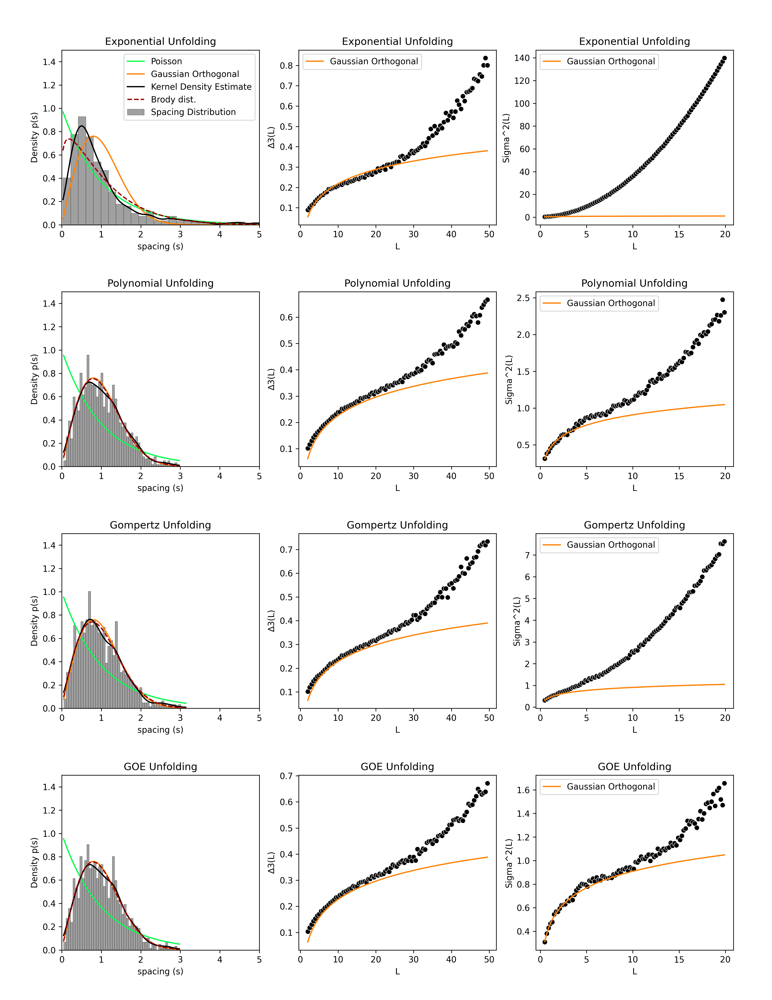
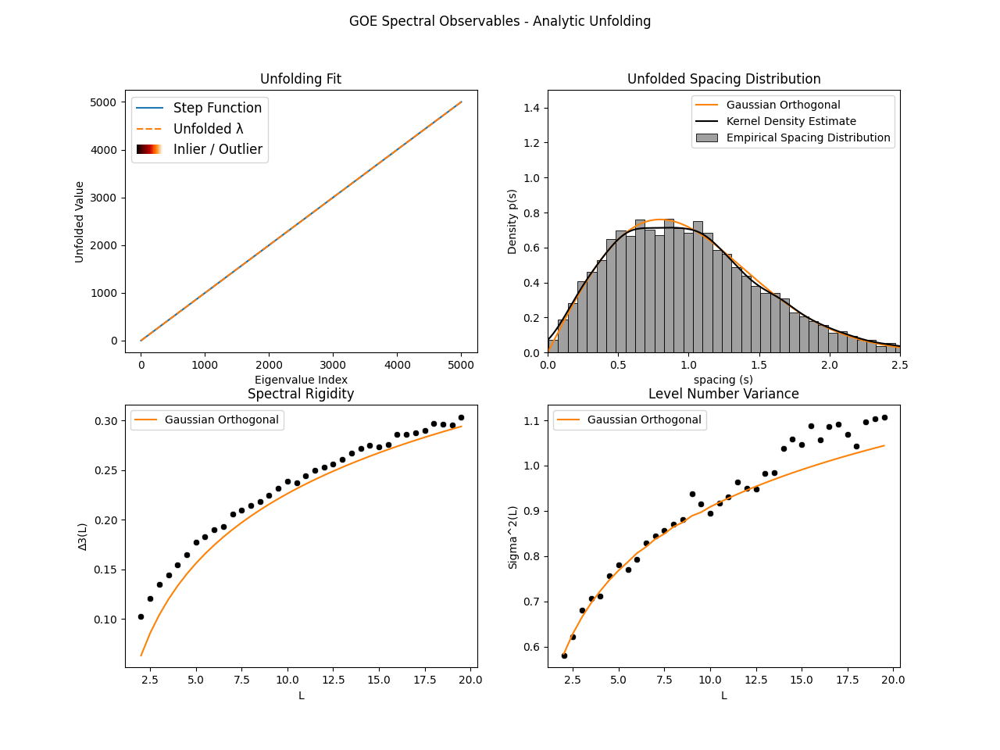
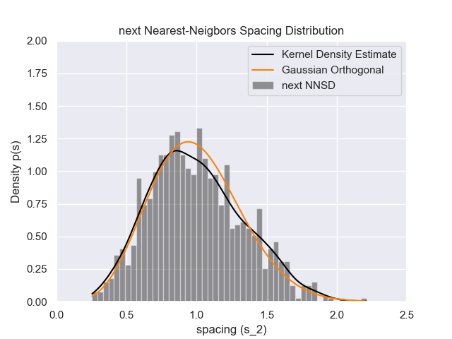
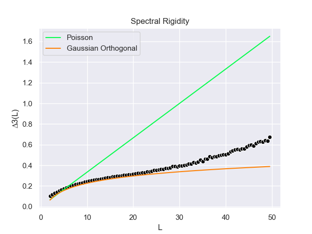
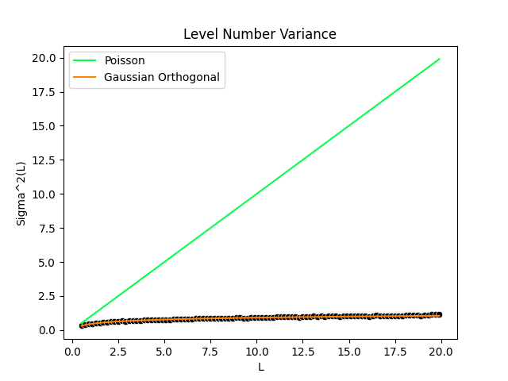
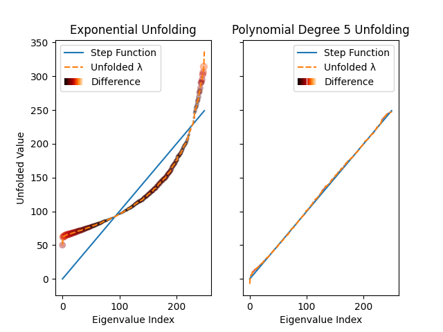

[](https://doi.org/10.5281/zenodo.7105502)


# empyricalRMT - Random Matrix Theory Tools for Python

A python library for investigating some of the basic / classical elements of
Random Matrix Theory, including eigenvalue generation, trimming, unfolding and
computation and plotting of some spectral observables.


- [empyricalRMT - Random Matrix Theory Tools for Python](#empyricalrmt---random-matrix-theory-tools-for-python)
- [Features](#features)
  - [Easy Unfolding, Trimming and De-Trending](#easy-unfolding-trimming-and-de-trending)
  - [Optimized Performance](#optimized-performance)
    - [Spectral Observables](#spectral-observables)
    - [GOE Eigenvalues](#goe-eigenvalues)
- [Examples](#examples)
- [Documentation](#documentation)
- [Installation](#installation)
  - [Pip](#pip)
  - [Poetry](#poetry)
  - [Development](#development)
  - [Windows](#windows)
- [Limitations](#limitations)

# Features

## Easy Unfolding, Trimming and De-Trending

Comparing actual eigenvalues to theory requires, in most cases, unfolding. This procedure
is often ad hoc, poorly documented, and dramatically impacts conclusions about the nature
of the systems under study.  With `empyricalRMT`, it is easy to unfold and visualize
different unfolding decisions:

```python
import matplotlib.pyplot as plt

from empyricalRMT.eigenvalues import Eigenvalues
from empyricalRMT.smoother import SmoothMethod

eigs = Eigenvalues.generate(1000, kind="goe")
unfoldings = {
    "Exponential": eigs.unfold(smoother=SmoothMethod.Exponential),
    "Polynomial": eigs.unfold(smoother=SmoothMethod.Polynomial, degree=5),
    "Gompertz": eigs.unfold(smoother=SmoothMethod.Gompertz),
    "GOE": eigs.unfold(smoother=SmoothMethod.GOE),
}
N = len(unfoldings)
    fig, axes = plt.subplots(ncols=3, nrows=N)
    for i, (label, unfolded) in enumerate(unfoldings.items()):
        title = f"{label} Unfolding"
        unfolded.plot_nnsd(
            title=title,
            brody=True,
            brody_fit="mle",
            ensembles=["goe", "poisson"],
            fig=fig,
            axes=axes[i][0],
        )
        unfolded.plot_spectral_rigidity(title=title, ensembles=["goe"], fig=fig, axes=axes[i][1])
        unfolded.plot_level_variance(title=title, ensembles=["goe"], fig=fig, axes=axes[i][2])
        axes[i][0].legend().set_visible(False) if i != 0 else None
        axes[i][1].legend().set_visible(False) if i != 0 else None
plt.show()
```




## Optimized Performance

### Spectral Observables

For a sample of unfolded eigenvalues, computation of the spectral rigidity,

$$ \Delta_3(L) = \left\langle \min_{A, B} \frac{1}{L} \int_c^{c+L} \Big( \eta(\lambda) - A \lambda - B \Big)^2 d\lambda \right\rangle_c $$

and level number variance

$$ \Sigma^2(L) = \big\langle  \eta^2(L, \lambda) \big\rangle -   \big\langle  \eta(L, \lambda) \big\rangle^2 $$

requires some non-trivial Monte-Carlo computations that border on intractable
with plain Python and even NumPy / scikit-learn / scipy. `empyricalRMT` uses
Numba and carefully written code to dramatically speed-up and parallelize the
computation of these metrics:

```python
import numpy as np
from timeit import repeat
from empyricalRMT.eigenvalues import Eigenvalues

unfolded = Eigenvalues.generate(5000, kind="goe").unfold(smoother="goe")
L = np.arange(2, 50, 1, dtype=np.float64)
results = repeat(
    "unfolded.spectral_rigidity(L)", number=10, globals=dict(unfolded=unfolded, L=L), repeat=10
)
print(f"Mean: {np.mean(results):0.2f}s. Range: [{np.min(results):0.2f}, {np.max(results):0.2f}]")

# Level number variance is far more variable for larger L, so use a smaller range here
L = np.arange(2, 20, 1, dtype=np.float64)
results = repeat(
    "unfolded.level_variance(L)", number=10, globals=dict(unfolded=unfolded, L=L), repeat=10
)
print(
    f"Mean: {np.mean(results):0.2f}s. Range: [{np.min(results):0.2f}, {np.max(results):0.2f}]"
)
```
```
Mean: 3.18s. Range: [2.88, 3.62]
Mean: 3.56s. Range: [3.08, 6.46]
```

### GOE Eigenvalues

Sample eigenvalues from *large* GOE matrices (provided they can fit in memory) ***fast*** via
[equivalently distributed tridiagonal matrices](https://dspace.mit.edu/handle/1721.1/115982):

```python
from empyricalRMT.construct import generate_eigs

eigs = generate_eigs(matsize=30000, kind="goe", log_time=True)

""" Output:
>>> 15:40:39 (Mar10) -- computing eigenvalues...
>>> 15:41:05 (Mar10) -- computed eigenvalues.
"""
```
E.g. under 30 seconds (Processor: 4-core / 8-threads, Intel(R)
Xeon(R) CPU E3-1575M v5 @ 3.00GHz).


# Examples

Sample a random GOE matrix and investigate some basic properties:

```python
import numpy as np

from empyricalRMT._types import MatrixKind
from empyricalRMT.eigenvalues import Eigenvalues
from empyricalRMT.smoother import SmoothMethod

# generate eigenvalues from a 2000x2000 sample from the Gaussian Orthogonal Ensemble
eigs = Eigenvalues.generate(matsize=2000, kind=MatrixKind.GOE)
# unfold "analytically" using Wigner semi-circle
unfolded = eigs.unfold(smoother=SmoothMethod.GOE)
# visualize core spectral observables and unfolding fit
unfolded.plot_observables(
    rigidity_L=np.arange(2, 20, 0.5),
    levelvar_L=np.arange(2, 20, 0.5),
    title="GOE Spectral Observables - Analytic Unfolding",
)
```




Plot some classic observables and compare to theory:

```python
import numpy as np

from empyricalRMT._types import MatrixKind
from empyricalRMT.eigenvalues import Eigenvalues
from empyricalRMT.smoother import SmoothMethod

# generate eigenvalues from a 2000x2000 sample from the Gaussian Orthogonal Ensemble
eigs = Eigenvalues.generate(matsize=5000, kind=MatrixKind.GOE)
ensembles = ["poisson", "goe"]  # theoretically expected curves to plot
unfolded.plot_nnsd(ensembles=ensembles)  # nearest neighbours spacings
unfolded.plot_nnnsd(ensembles=["goe"])  # next-nearest neighbours spacings
unfolded.plot_spectral_rigidity(ensembles=ensembles)
unfolded.plot_level_variance(ensembles=ensembles)
```






Visually inspect / detect a questionable unfolding fit:

```python
import matplotlib.pyplot as plt

from empyricalRMT.eigenvalues import Eigenvalues
from empyricalRMT.smoother import SmoothMethod

# generate time series data
T = np.random.standard_normal([1000, 250])
eigs = Eigenvalues.from_time_series(T, trim_zeros=False)

exp_unfolded = eigs.unfold(smoother=SmoothMethod.Exponential)
poly_unfolded = eigs.unfold(smoother=SmoothMethod.Polynomial, degree=5)

fig, (ax1, ax2) = plt.subplots(nrows=1, ncols=2, sharex=True, sharey=True)
exp_unfolded.plot_fit(fig=fig, axes=ax1, title="Exponential Unfolding")
poly_unfolded.plot_fit(fig=fig, axes=ax2, title="Polynomial Degree 5 Unfolding")
plt.show()
```




# Documentation

The [source
code](https://github.com/stfxecutables/empyricalRMT/tree/master/empyricalRMT)
aims to be well documented, and is the sole documentation for the project. If
you are using Python interactively (e.g. in a Jupyter notebook or REPL) then
these comments are quickly available by calling `help(rmt_object)`. If youare
using a decent IDE or editor with appropriate extensions (e.g. PyCharm, VSCode,
modern Jupyter) you should be able to see the documentation on mouse hover or
via your editor shortcuts (e.g. Go To Definition).

Mostly, you just want import `empyricalRMT.eigenvalues.Eigenvalues` and use
either `Eigenvalues.generate()`  to get fresh random eigenvalues, or
`Eigenvalues(eigs)` for some `ArrayLike` `eigs`. Trimming and unfolding
methods are available on `Eigenvalues` instances, and `Eigenvalues.unfold()`
gives you an `empyricalRMT.unfold.Unfolded` instance, which has methods for
visualization and/or computation of spectral observables.

Otherwise, functional forms of core functions for computing spectral observables
are located in `empyricalRMT.observables`, if you just want to pass in raw
NumPy arrays and get e.g. the spectral rigidity or level number variance.


# Installation


## Pip

```sh
pip install empyricalRMT
```

## Poetry

In your project using [Poetry](https://python-poetry.org):

```sh
poetry add empyricalRMT && poetry install
```

## Development

```sh
git clone https://github.com/stfxecutables/empyricalRMT
cd empyricalRMT
poetry install --with dev
poetry shell
```

Run tests with `pytest`.

## Windows

Note this library is completely untested on Windows, but *might* work, if the
dependencies also work on Windows. I've tried to use practices that have led
to successful portability to Windows in the past, and there is nothing *too*
fancy going on here, but it still very likely something will break on Windows.


# Limitations

This library was and is being developed on a reasonably decent machine (4 cores
/ 8 threads, 3.00GHz, 64GB RAM) that is currently running Ubuntu 18.04 LTS. Out
of convenience, I have used Numba, but I know that this is not the most portable
solution available, and may result in some issues.

Default values for most parameters were chosen because they provided reasonably
accurate results (e.g. when compared to as predicted by theory) in reasonable
amounts of time on *this machine*. I have tested the library on my old 2015
MacBook, and the defaults seem *okay*, but it is possible that they may not work
well on your machine, especially with regards to memory.

RMT results are theoretical, and many results only hold for real numbers, as N
approaches infinity. In practice, it seems that floating-point precision issues
(whether in numerical integration, solving of eigenproblems, or in the
convergence of some of the stochastic methods used in this library) plus the
reality of working with finite matrices means that there are significant limits
on the extent to which simulations agree with theory, especially when looking at
long-range spectral observables (e.g. spectral rigidity or level number variance
for L > 20) and when matrices are small (N < 2000).

Finally, I am just a dabbler in RMT. I have tried to limit myself to
implementing only aspects I feel I understand, but I may have made some basic
errors in implementation or understanding at some point. If you notice any
issues or mistakes, corrections are always warmly welcomed!
